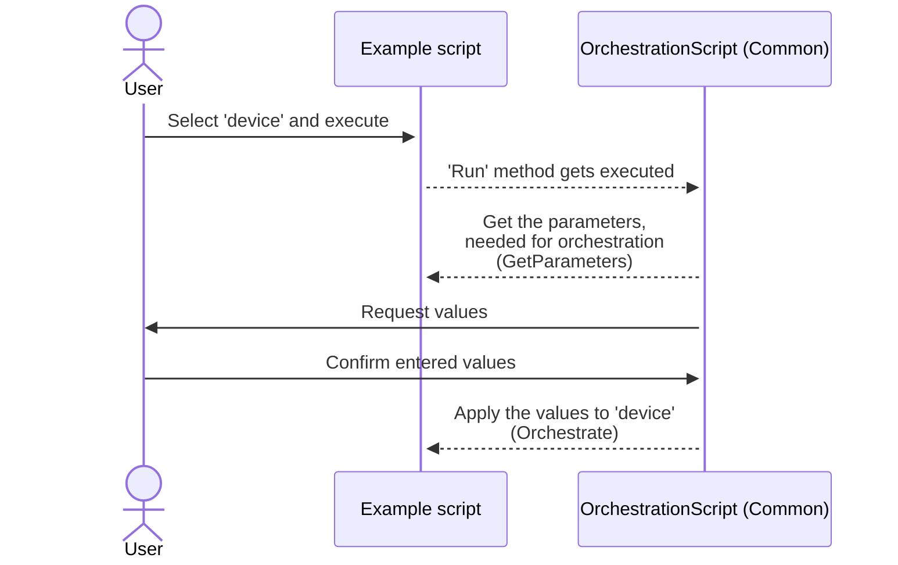

# Technical Documentation for the OrchestrationHelper - Example

This is a custom solution for DataMiner to demo the 'OnRequestScriptInfo' entry point. Details about the entry point are available here: [TODO](https://docs.dataminer.services/entry-points/orchestration-helper/on-request-script-info/).

## Scripts

The scripts part of this example can be used to develop an orchestration helper based on that entry point. Each use case will be explained here.

> [!NOTE]
> The scripts are available in the folder *OrchestrationHelperExample* and are also prefixed with <em>OrchestrationHelperExample - </em>.

### Common

The library script of this example that contains the common logic and gets referenced by each script.

### [Orchestration script example](/OrchestrationHelperExample%20-%20Orchestration%20script%20example/OrchestrationHelperExample%20-%20Orchestration%20script%20example.cs)

This script is the actual orchestration script. The `Script` class implements the [`OrchestrationScript` class](OrchestrationHelperExampleShared/Helpers/OrchestrationScript.cs) so the complexity of implementing the entry point can be obfuscated.

Executing the script will display a basic dialog to request a value for each defined parameter. After the confirming the dialog those values get applied to the dummy that was selected when executing the script.

#### `GetParameters(IEngine engine)`

Basically returns a list of parameters that the orchestration script needs, together with a link to the profile parameter.

Each parameter has an ID that is unique within the script. That parameter is then used in `Orchestrate` to get the value that was gathered.

Remarks:

- The script ID of each parameter isn't checked for its uniqueness. It might be worth adding such check to avoid confusion.
- Ideally the profile parameters are referenced by their name. For a user it is easier to copy/paste these from UI and they'll be easy to understand. Profile parameter, definition and instance names are not required to be unique, even if the UI lets you believe otherwise. It could be that duplicate names exist within the cluster, for instance if these types are imported from mixed function packages. The orchestration solution might set this as requirement of course.
- In the example the `engine` parameter is available if some advanced logic is required, but that parameter could as well be removed.
- The dummy, or any other script parameter or memory file this script has defined, might not be available at the time this method gets executed. This method gets called most likely, when the 'OnRequestScriptInfo' entry point is executed. The script arguments aren't required to be set in that case.

#### `Orchestrate(IEngine engine, OrchestrationHelperWithInfo helper)`

The helper that gets passed allows to get parameter values that were provided or entered.

`helper.GetParameterValue(string id)` will return the value provided or entered for the Parameter with the specified ID.

`helper.GetParameterInfos()` will return the info for all Parameters together with its value.

Remarks:

- Ideally the orchestration get extended with a logging framework, so issues, debug info and timing can be easily checked within the solution that will execute the orchestration scripts. In this example nothing gets logged.
- `.ShowUI(` was added to trick the Automation module in believing this is an automation script that requires interactivity. Task [DCP257459](https://collaboration.dataminer.services/task/257459) will add a feature allowing to clearly enforce that option in the XML of the script. This script should eventually be marked as *Interactivity*/*Always*.
- When using *SetParameter* an automation script will generate an information event with the value that was set. Since generating these is strongly discouraged, it might be worth disabling that by adding the following in the `OrchestrationHelper` or in the template:
`engine.SetFlag(RunTimeFlags.NoInformationEvents)`

#### Link

The name of a script that was suited to orchestrate a specific device can be stored in the Profile Definition (ref. Scripts region in Cube). The Profile Definition could then be found, since it was defined on the Function of a Resource. Because this requires Function Resources, Functions and Profile Definition, and since the Profile Definition is now defined in the script itself, this option has become less viable.

The script name could for instance be defined on the Resource Pool level.

### [Get orchestration Info](/OrchestrationHelperExample%20-%20Get%20Orchestration%20Info/OrchestrationHelperExample%20-%20Get%20Orchestration%20Info.cs)

This example script will gather all the parameter info available in an orchestration script. When executing the script, the name of the orchestration script should be entered as 'Script name'.

Use case:
TBD

> [!IMPORTANT]
> This example makes use of GenerateInformation to easily see what parameters are defined in the script. Using information is strongly discouraged.
