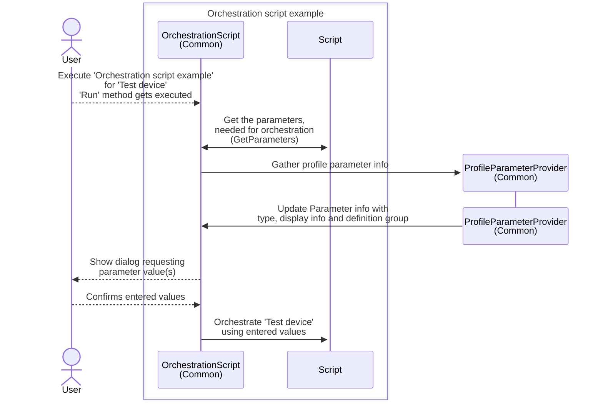
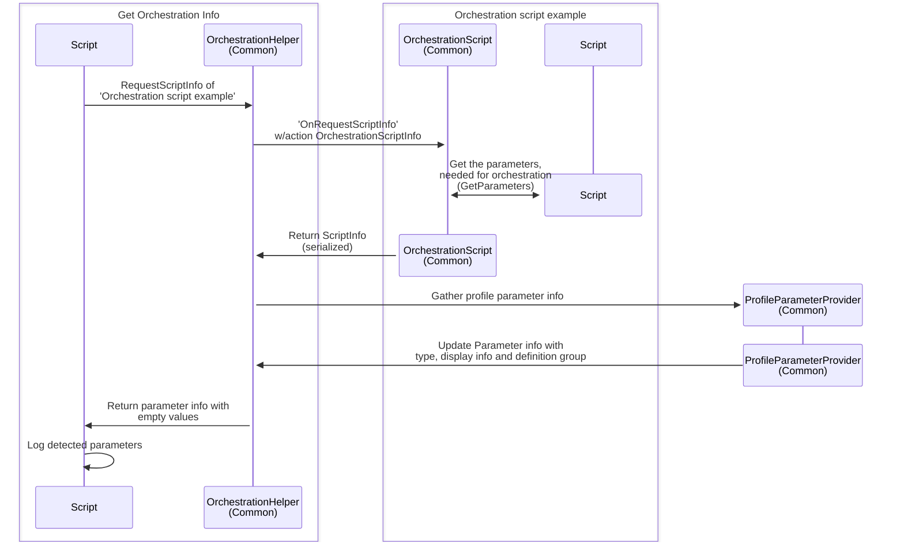
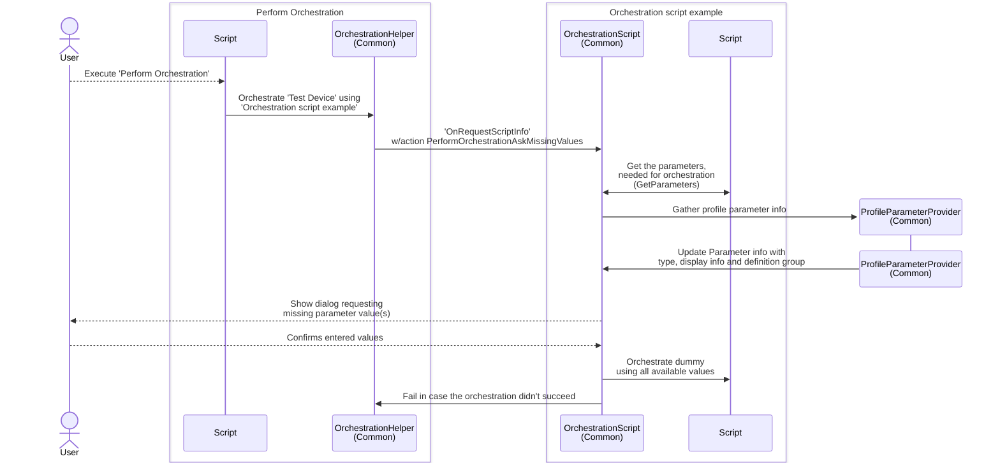

# Technical Documentation for the OrchestrationHelper example

In this example solution for DataMiner, a library was created to easily implement Automation scripts that orchestrate a function of a device, resource or element. The 'OnRequestScriptInfo' entry point is used to detect which values, defined as profile parameters, such a script needs to perform the orchestration.

Details about implementing the entry point in an Automation script will be available on the docs soon.

## Contents

Installing the solution package will deploy the following things:

- Connector: Generic Dynamic Table (1.0.0.4)
- Element: 'OrchestrationHelperExample - Test Device'
- [Scripts](#scripts) part of the example

## Scripts

The scripts part of this example can be used to develop an orchestration helper based on that entry point. Each use case will be explained here.

> [!NOTE]
> The scripts are available in the *OrchestrationHelperExample* folder and are also prefixed with <em>OrchestrationHelperExample - </em>.

### [Common](/OrchestrationHelperExample.Common)

The library script of this example that contains the common logic and gets referenced by each script.

### [Orchestration script example](/OrchestrationHelperExample%20-%20Orchestration%20script%20example/OrchestrationHelperExample%20-%20Orchestration%20script%20example.cs)

This script is the actual orchestration script. The `Script` class implements the [`OrchestrationScript` class](OrchestrationHelperExampleShared/Helpers/OrchestrationScript.cs) so the complexity of implementing the entry point can be obfuscated for the user implementing the orchestration script.

Executing the script will display a basic dialog to request a value for each defined parameter. After confirming the dialog, those values get applied to the dummy that was selected when executing the script.

Flow:



#### `GetParameters(IEngine engine)`

This method needs to return a list of parameters that the orchestration script needs, together with a link to the profile parameter.

Each parameter has an ID that is unique within the script. That parameter is then used in `Orchestrate` to get the value that was provided.

Example remarks and potential improvements:

- The script ID of each parameter isn't checked for its uniqueness. It might be worth adding such check to avoid confusion.
- The script ID of each parameter is matched case sensitive. To ease up the implementation of an orchestration script, that behavior could be reviewed.
- Ideally the profile parameters are referenced by their name. For a user, it is easier to copy/paste these from a UI and they'll be easy to understand. Profile parameter, definition and instance names are not required to be unique, even if the Cube UI suggests otherwise. It could be that duplicate names exist within the cluster, for instance if these types are imported from mixed function packages. The orchestration solution might set this as requirement of course.
- In the example the `engine` parameter is passed to the method for completeness. That input parameter might as well be removed, since interaction with Automation or DataMiner is best to be avoided to keep the execution time of this method limited.
- Any dummies, script parameter or memory files this script has defined, might not be available at the time this method gets executed. This method gets called most likely when the `OnRequestScriptInfo` entry point is executed. The script arguments aren't required to be set in that case.

#### `Orchestrate(IEngine engine, OrchestrationHelperWithInfo helper)`

The helper that gets passed allows to get parameter values that were provided or entered.

`helper.GetParameterValue(string id)` will return the value provided or entered for the Parameter with the specified ID.

`helper.GetParameterInfos()` (not used in the example) will return the info for all Parameters together with their provided values.

Example remarks and potential improvements:

- Ideally, the orchestration should be extended with a logging framework, so issues, debug info and timing can be easily checked within the solution that will execute these orchestration scripts. In this example no logging was introduced.
- `.ShowUI(` was added to trick the Automation module in believing this is an automation script that requires interactivity. Task [DCP257459](https://collaboration.dataminer.services/task/257459) will add a feature allowing to clearly enforce that option in the XML of the script. This script should eventually be marked as *Interactivity*/*Always*.
- When using *SetParameter*, an automation script will generate an information event with the value that was set. Since generating these is strongly discouraged, it might be worth disabling that by adding the following in the `OrchestrationHelper` or in the orchestration script template:
`engine.SetFlag(RunTimeFlags.NoInformationEvents)`.

#### Linking the script

At the time a device, resource or element needs to be orchestrated, the script responsible for the orchestration will need to be available for the orchestration helper.

A Profile Definition allows storing the names for scripts that apply them (ref. Scripts region in the Cube UI). The Profile Definition is now defined in the script itself, so this option has become less viable. It could from now on be stored on the Resource Pool level instead.

### [Get orchestration Info](/OrchestrationHelperExample%20-%20Get%20Orchestration%20Info/OrchestrationHelperExample%20-%20Get%20Orchestration%20Info.cs)

This example script will gather all the parameter info available in an orchestration script. When executing the script, the name of the orchestration script (i.e. 'OrchestrationHelperExample - Orchestration script example') should be provided as 'Script name'. The parameter info that was found then gets logged by this script.

Flow:



> [!NOTE]
> This example can be used to gather which parameters a device requires. The flow could then be extended to ask a user what values these parameters should have. An example of that flow [is available here](/OrchestrationHelperExampleShared/Helpers/OrchestrationHelperInfoFactory.cs#L281).

### [Perform Orchestration](/OrchestrationHelperExample%20-%20Perform%20Orchestration/OrchestrationHelperExample%20-%20Perform%20Orchestration.cs)

This example script will orchestrate the test device. It has some predefined values declared, but is missing a value for the 'Bit rate' parameter.

Similar to the 'Get orchestration Info' script, this example script will gather all the parameter info available in an orchestration script. It will check if all values are available.

Since the 'askMissingValues' is set to true when executing 'Orchestrate', the value for 'Bit rate' will be requested before the orchestration is started. When 'askMissingValues' is set to false, the value for the missing parameters will be `null`.
Adding the following line to the dictionary will set a value for that parameter:

```csharp
{ new ProfileParameterID(Parameters.BitRate.Id), 3d },
```

No values will be requested and the orchestration will immediately start.

**Remark:** `.FindInteractiveClient(` was added to trick the Automation module in believing this is an automation script that might display interactivity. Task [DCP257459](https://collaboration.dataminer.services/task/257459) will add a feature allowing to clearly enforce that option in the XML of the script. This script should eventually be marked as *Interactivity*/*Optional*.

Flow:


